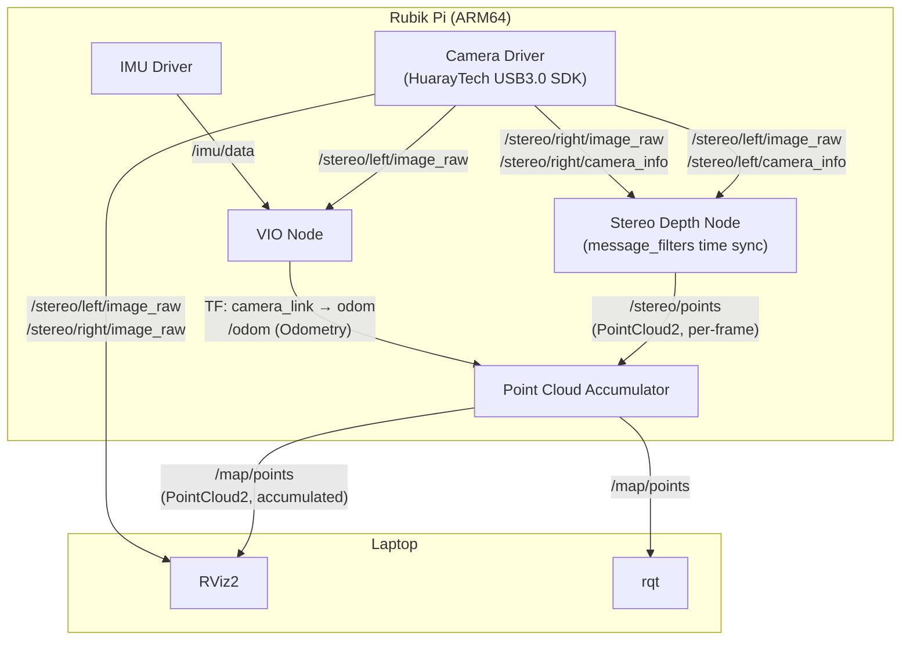
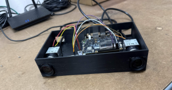
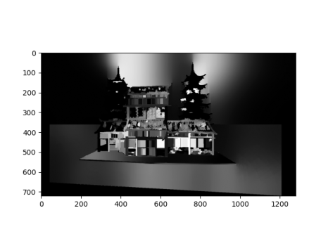
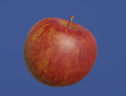
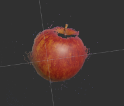
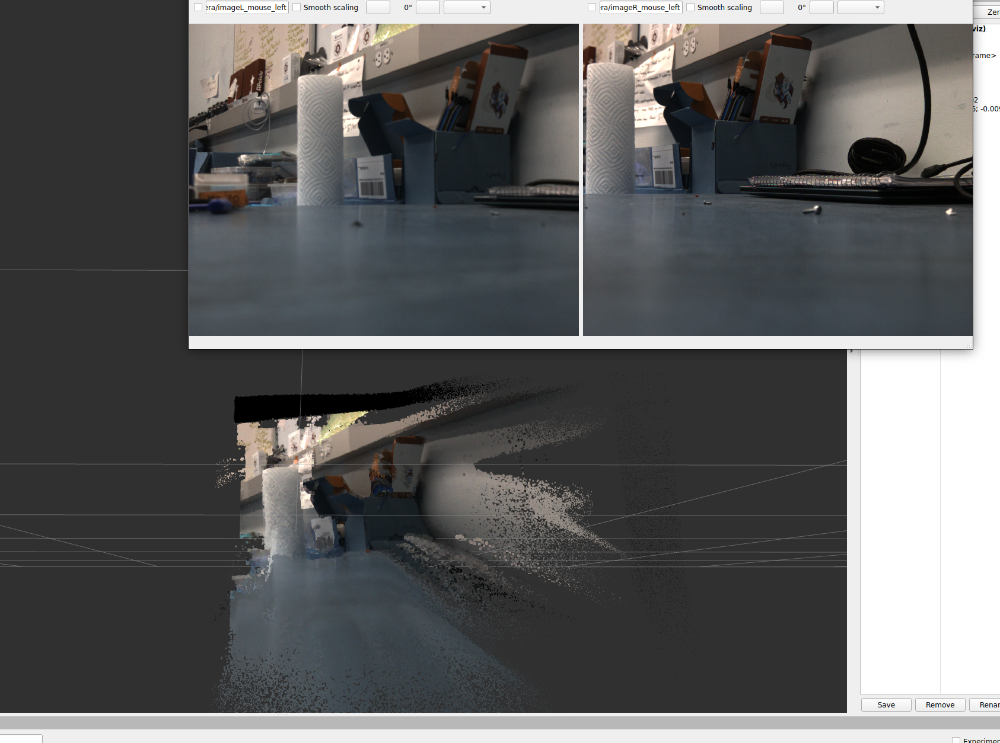

# Stereo Camera 3D Perception System

> **CSE 145 — Spring 2026 | UC San Diego**

<!-- TODO: Add a hero banner image (system mounted on robot / point cloud visualization) -->

A real-time stereo vision pipeline running on a Rubik Pi (ARM64 SBC) that captures synchronized dual-camera frames, performs stereo rectification and feature matching, and publishes colored 3D point clouds over ROS 2. The system targets 100 fps operation and is fully containerized with Docker for reproducible deployment on both development machines (x86) and the embedded target (ARM64).

---

## Table of Contents

- [Abstract](#abstract)
- [System Architecture](#system-architecture)
- [Hardware](#hardware)
- [Repository Organization](#repository-organization)
- [Setup & Replication](#setup--replication)
- [Running the System](#running-the-system)
- [Results](#results)
- [Team](#team)
- [Class Deliverables](#class-deliverables)

---

## Abstract

Depth perception is a core capability for autonomous robots. This project builds a compact, self-contained stereo camera system that runs entirely on an edge device (Rubik Pi, ARM64). Two HuarayTech USB3.0 cameras are hardware synchronized and processed by a ROS 2 pipeline that rectifies the stereo pair, matches keypoints, triangulates 3D positions, and publishes a colored `PointCloud2` topic in real time. A dense disparity map is also implemented for denser reconstructions. An IMU node and a Visual-Inertial Odometry (VIO) node provide real-time motion tracking, enabling scene reconstruction such as walking through a room while holding the camera.

---

## System Architecture

The pipeline runs on a Rubik Pi (ARM64). A laptop connects over the network to visualize topics in RViz2 and rqt — no custom nodes are required on the laptop side.



<!-- TODO: Add RViz2 screenshot showing accumulated point cloud output -->

### ROS 2 Topic Reference

| Topic | Type | Publisher | Subscriber(s) |
|-------|------|-----------|---------------|
| `/stereo/left/image_raw` | `sensor_msgs/Image` | Camera Driver | Stereo Depth, VIO |
| `/stereo/left/camera_info` | `sensor_msgs/CameraInfo` | Camera Driver | Stereo Depth |
| `/stereo/right/image_raw` | `sensor_msgs/Image` | Camera Driver | Stereo Depth |
| `/stereo/right/camera_info` | `sensor_msgs/CameraInfo` | Camera Driver | Stereo Depth |
| `/imu/data` | `sensor_msgs/Imu` | IMU Driver | VIO |
| `/stereo/points` | `sensor_msgs/PointCloud2` | Stereo Depth | Point Cloud Accumulator |
| `/map/points` | `sensor_msgs/PointCloud2` | Point Cloud Accumulator | (visualization) |
| `/odom` | `nav_msgs/Odometry` | VIO | (visualization) |
| TF `camera_link → odom` | — | VIO | Point Cloud Accumulator |

### Node Descriptions

**Camera Driver** — Interfaces with the HuarayTech USB3.0 SDK and publishes synchronized left and right image streams alongside calibrated `CameraInfo` messages.

**IMU Driver** — Reads the onboard IMU and publishes raw inertial measurements on `/imu/data`.

**Stereo Depth Node** — Uses `message_filters` with an approximate time synchronizer to receive left image, right image, and both `CameraInfo` topics simultaneously. Performs stereo rectification, keypoint detection and matching (ORB/AKAZE/SIFT), and triangulation to produce a per-frame colored `PointCloud2` on `/stereo/points`. A dense path via StereoBM / StereoSGBM + WLS filter is also available.

**VIO Node** — Fuses left camera frames with IMU data to estimate 6-DOF ego-motion. Publishes the `camera_link → odom` transform into the TF tree, which the accumulator uses to register successive point cloud frames into a common map frame.

**Point Cloud Accumulator** — Subscribes to per-frame point clouds on `/stereo/points` and looks up the current `camera_link → odom` TF to transform each frame into the odom frame. Maintains a sliding-window accumulated cloud published on `/map/points` for dense map visualization.

---

## Hardware

| Component | Details |
|-----------|---------|
| Single-board computer | Rubik Pi (ARM64, Ubuntu Noble) |
| Cameras | 2× HuarayTech USB3.0 cameras |
| Camera baseline | ~55.6 mm |
| Focal length | 623.54 px (1280×720) |
| Target frame rate | 100 fps |



---

## Setup & Replication

### Prerequisites

- [Docker](https://docs.docker.com/engine/install/ubuntu/) with BuildKit
- VS Code + [Dev Containers extension](https://marketplace.visualstudio.com/items?itemName=ms-vscode-remote.remote-containers)
- `git lfs`

### Development environment (x86 laptop / desktop)

```bash
# 1. Clone the repo
git clone https://github.com/LuminousLlama/CSE145-SP26-Stereo-Camera.git
cd CSE145-SP26-Stereo-Camera

# 2. Pull LFS assets (vendor SDK, test images)
sudo apt install git-lfs
git lfs install
git lfs pull

# 3. Allow GUI apps from inside Docker to display on your desktop
xhost +local:docker   # run this after every reboot

# 4. Open in VS Code → Command Palette → "Dev Containers: Reopen in Container"
```

The dev container mounts your workspace and gives you a fully sourced ROS 2 Jazzy environment with rviz2, rqt, and all dependencies pre-installed.

### Rubik Pi (ARM64 target)

#### One-time hardware setup

```bash
# Required before installing HuarayTech SDK
sudo apt update
sudo apt install build-essential linux-headers-$(uname -r)

# Install ROS 2 Jazzy
# https://docs.ros.org/en/jazzy/Installation/Ubuntu-Install-Debs.html

# Connect to UCSD WiFi
sudo nmcli --ask connection up UCSD-PROTECTED
```

#### Deploy with Docker (recommended)

```bash
# Pull the pre-built multi-arch image
docker pull luminousllama/stereo-camera:latest

# Run (replace /dev/bus/usb with the USB bus path for your cameras if needed)
docker run --rm --privileged \
  --device /dev/bus/usb \
  luminousllama/stereo-camera:latest \
  bash -c "source /ros2_ws/install/setup.bash && ros2 run depth_estimation_node pointcloud_pub"
```

### Build the multi-arch image from source

```bash
# Set up cross-compilation (run once)
docker run --privileged --rm tonistiigi/binfmt --install all
docker buildx create --name multiarch --driver docker-container --use
docker buildx inspect --bootstrap

# Build and push both amd64 and arm64
docker buildx build --platform linux/amd64,linux/arm64 \
  -t luminousllama/stereo-camera:latest --push .
```

---

## Running the System

All commands are run inside the Docker container (or with ROS 2 sourced on the Pi).

```bash
# Terminal 1 — Camera driver
ros2 run camera_node camera_node

# Terminal 2 — Depth estimation + point cloud publisher
ros2 run depth_estimation_node pointcloud_pub

# Terminal 3 — Visualize in RViz2
rviz2
# Add a PointCloud2 display, set the topic to /map/points
```

### Unit tests

```bash
cd src/depth_estimation_node/depth_estimation_node
python3 -m unittest stereo.PointcloudTests -v
```

---

## Results

### Disparity map

Dense disparity computed from a rectified stereo pair. Brighter pixels indicate objects closer to the camera.



### Point cloud — test object

A synthetic apple (left) used as a controlled test target and the resulting sparse colored point cloud (right) reconstructed by the stereo depth pipeline.

| Test input | Reconstructed point cloud |
|------------|--------------------------|
|  |  |

### Live point cloud — real-world scene

Stereo camera feed (top) and the corresponding accumulated point cloud visualized in RViz2 (bottom).



<!-- TODO: Add demo video or GIF -->

---

## Team

| Name | GitHub | 
|------|--------|
| Keyush Attarde | [@LuminousLlama](https://github.com/LuminousLlama) |
| Arihant Jain | [@arugoa](https://github.com/arugoa) | 
| Sumukh Murthy | [@Augustus31](https://github.com/Augustus31) | 
| Rishi Gupta | [@rishi-gupta1](https://github.com/rishi-gupta1) | 

---

## Class Deliverables

| Deliverable | Link |
|-------------|------|
| Project proposal | [link](https://docs.google.com/document/d/16BQCKNN_kMCmDwq1k3PHfmX4vHF8bQ6GTnL5cHkMJDA/edit?usp=sharing) |
| Mid-quarter presentation | [link](https://docs.google.com/presentation/d/1rlb7xDEcJRjnbSVHFM9I3vvndymEe9qnN4Q5-PZehVo/edit?usp=sharing) |
| Milestone report | [link](https://docs.google.com/document/d/1ypv7qFk5GyYYtw_OReDS5JNMfPo7DEk6jCHK5sVsoTQ/edit?usp=sharing) |
| Final presentation | TODO |
| Final report | TODO |
| Demo video | TODO |
